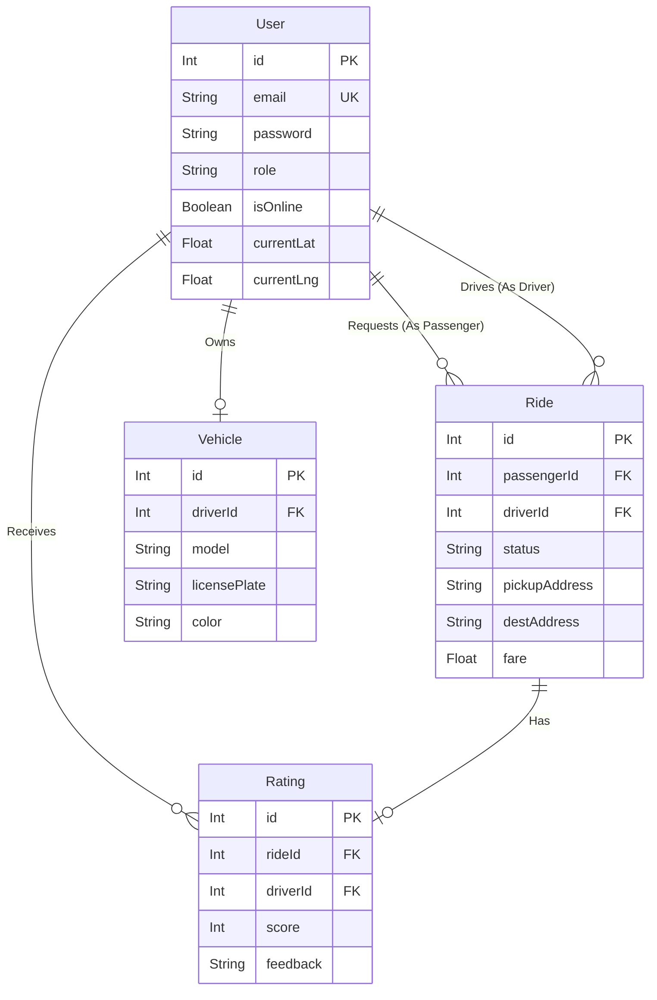

# Campus Ride: System Design Document
---

## 1. Problem Understanding

**Context**
"Campus Ride" is a real-time ride-sharing platform specifically tailored for a campus environment. The goal is to provide a seamless, quick, and safe way for students, faculty, and campus staff to request rides (Passengers) and for vehicle owners within the campus to offer rides (Drivers).

**Core Requirements**
- **Dual Roles:** Users can operate as Passengers or Drivers.
- **Real-Time Tracking:** Passengers need to see available drivers nearby and track their assigned driver's location in real-time.
- **Instant Matching:** Ride requests must be instantly broadcasted to online drivers.
- **Ride Lifecycle Management:** The system must handle state transitions for rides: Requested -> Accepted -> In Progress -> Completed (or Cancelled).
- **Safety & Trust:** The system must track driver details (KYC, vehicle info) and maintain a rating system to ensure a trustworthy environment.

---

## 2. System Architecture

The architecture follows a modern, decoupled client-server model, utilizing WebSockets for real-time communication.

### 2.1 Frontend (Client Application)
- **Framework:** React.js (via Vite)
- **Routing:** React Router DOM
- **State Management & API:** Axios for REST API calls, React Hooks.
- **Real-Time Client:** Socket.io-client for bi-directional communication.
- **Mapping & Geolocation:** Leaflet & React-Leaflet for rendering maps and plotting coordinates.
- **Styling:** Tailwind CSS (via clsx & tailwind-merge).

### 2.2 Backend (Server Application)
- **Runtime Environment:** Node.js
- **Web Framework:** Express.js (REST API provision)
- **Real-Time Engine:** Socket.io (WebSocket connections)
- **Authentication:** JSON Web Tokens (JWT) & bcrypt for password hashing.
- **Database ORM:** Prisma Client
- **Database:** SQLite (via @libsql/client) - optimized for single-node fast read/writes during the campus deployment phase.

### 2.3 High-Level Flow
1. **HTTP/REST** is used for transactional, state-agnostic requests (Authentication, Profile Updates, fetching Ride History).
2. **WebSockets** are used for stateful, continuous data streams (Location sharing, Ride dispatching, Status updates).

---

## 3. Database Schema

The database relies on a relational model managed by Prisma. 

### 3.1 `User` Table
Central table for authentication and profile management.
- `id` (Primary Key, Int)
- `email` (Unique String), `password` (String)
- `name` (String), `role` (String: "PASSENGER" or "DRIVER")
- `phone`, `upiId`, `gender`, `profilePhoto` (Optional Strings)
- **Driver-Specific Fields:** `isOnline` (Boolean), `currentLat` / `currentLng` (Float), `nationalId`, `driverLicense`, `bankAccount` (Optional KYC fields).
- `createdAt`, `updatedAt` (DateTime)

### 3.2 `Vehicle` Table
Stores vehicle information linked to a specific driver.
- `id` (Primary Key, Int)
- `driverId` (Foreign Key -> User.id)
- `type`, `model`, `licensePlate`, `rcNumber`, `color` (Strings)

### 3.3 `Ride` Table
Tracks the complete lifecycle of a ride request.
- `id` (Primary Key, Int)
- `passengerId` (Foreign Key -> User.id)
- `driverId` (Foreign Key -> User.id, Nullable)
- `status` (String: "REQUESTED", "ACCEPTED", "IN_PROGRESS", "COMPLETED", "CANCELLED")
- `pickupLat`, `pickupLng`, `pickupAddress` (Location Data)
- `destLat`, `destLng`, `destAddress` (Destination Data)
- `fare` (Float, Nullable)
- `createdAt`, `updatedAt` (DateTime)

### 3.4 `Rating` Table
Manages feedback given to drivers post-ride.
- `id` (Primary Key, Int)
- `rideId` (Foreign Key -> Ride.id, Unique)
- `driverId` (Foreign Key -> User.id)
- `score` (Int: 1 to 5)
- `feedback` (String, Optional)
- `createdAt` (DateTime)

---

## 4. Entity Relationship Diagram (ERD)

---

## 5. API Overview

The system uses a hybrid communication model: REST for CRUD operations and WebSockets for real-time events.

### 5.1 RESTful Endpoints
**Authentication API (`/auth`)**
- `POST /register`: Create a new user account.
- `POST /login`: Authenticate and receive JWT.
- `GET /profile`: Retrieve logged-in user profile.

**User API (`/users`)**
- `GET /profile`: Get user details.
- `PUT /profile`: Update user details (e.g., phone, upiId).

**Ride API (`/rides`)**
- `POST /request`: Initiate a new ride request (Passenger).
- `GET /drivers`: Fetch a list of nearby available drivers (Passenger).
- `PUT /availability`: Toggle driver online/offline status (Driver).
- `GET /active`: Retrieve ongoing ride details.
- `GET /requests`: Fetch pending ride requests nearby (Driver).
- `GET /history`: Fetch past rides for the user.
- `POST /:id/rating`: Submit a 1-5 star rating and feedback for a completed ride.

### 5.2 WebSocket Events
**Emitted by Client (Listened by Server):**
- `update_driver_location`: Driver sends GPS coordinates.
- `update_passenger_location`: Passenger sends GPS coordinates.
- `new_ride_request`: Passenger broadcasts a ride intent.
- `accept_ride`: Driver accepts a pending request.
- `update_ride_status`: Driver updates ride progress (`IN_PROGRESS`, `COMPLETED`).
- `cancel_ride` / `cancel_ride_driver`: Either party aborts the ride.

**Emitted by Server (Listened by Client):**
- `driver_location_update`: Broadcasts driver movement to passengers.
- `incoming_ride_request`: Notifies online drivers of a new passenger.
- `ride_accepted`: Notifies passenger that a driver is assigned.
- `ride_status_updated`: Pushes state changes to the specific ride room.
- `ride_cancelled_by_passenger`: Removes the request from drivers' queues.

---

## 6. Design Decisions

1. **Single User Table for Both Roles:**
   Instead of separate `Passenger` and `Driver` tables, a unified `User` table with a `role` enum is used. This vastly simplifies authentication logic, token generation, and allows for potential future flexibility (e.g., a student who is a passenger today can become a driver tomorrow without migrating tables).

2. **Socket.io Rooms for Privacy & Efficiency:**
   The WebSocket architecture utilizes "Rooms" (e.g., `user_{id}`, `ride_{rideId}`). This prevents broadcasting sensitive location data globally. A passenger only receives location updates from their specific driver, drastically reducing network overhead and improving battery life on mobile devices.

3. **Prisma with SQLite for the MVP:**
   Given the "Campus" scope of the project, SQLite paired with Prisma offers an embedded, zero-configuration database that is highly performant for a localized user base. The use of Prisma allows for a seamless migration to PostgreSQL or MySQL in the future if the application scales beyond the campus environment, requiring zero application-level code changes.

4. **Decoupled Architecture:**
   By separating the Vite/React frontend and the Express/Node backend, the application is ready for cross-platform expansion. The backend serves purely as an API and Event Server, meaning a React Native mobile app could be developed later and plugged into the existing backend with minimal friction.

5. **Optimistic UI Updates (via WebSockets):**
   Instead of relying on REST polling (which is resource-intensive), the system pushes state changes via WebSockets. When a driver accepts a ride, the UI updates instantly without requiring the passenger's app to refresh or poll the server, creating a highly responsive, premium feel.
